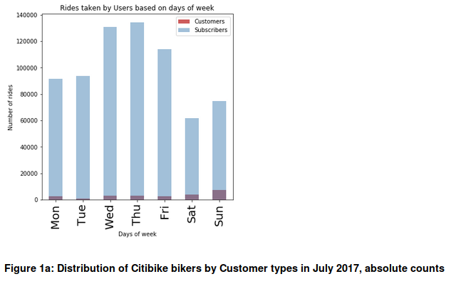
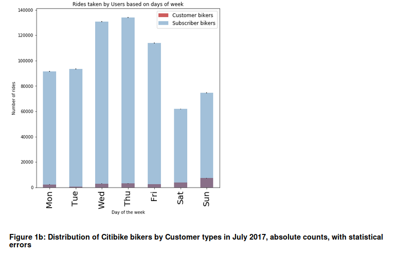
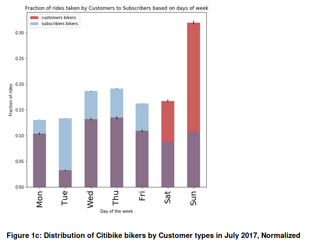

In this Project we tried to work on the data-driven inference based on CitiBike data.

We Chose a dataset from Citibike data Library that is available [here] (https://s3.amazonaws.com/tripdata/index.html)

We wrote a program to Derive Correlation from Citibike Data.

Initially I tried to derive correlation between the Age and average trip duration for each age group. But I was not succesful on that effort so I went ahead and derived a correlation between the type of customer and Citibike Usage.

By observing the data I found out that during the weekdays Subscribers utilize more Citibike than the Customers and viz.

Problem Statement: Does Subscribers take more rides on weekdays than Customers?

Alternate Hypothesis: Subscribers take more rides on Citibikes more than Customers during Weekdays.

Null Hypothesis: Customers take the same or more number of rides than Subscribers during Weekdays.

Since the value of Z>2 which is more than 2 Standard deviations above New Mean.

The Null Hypothesis Can be rejected

